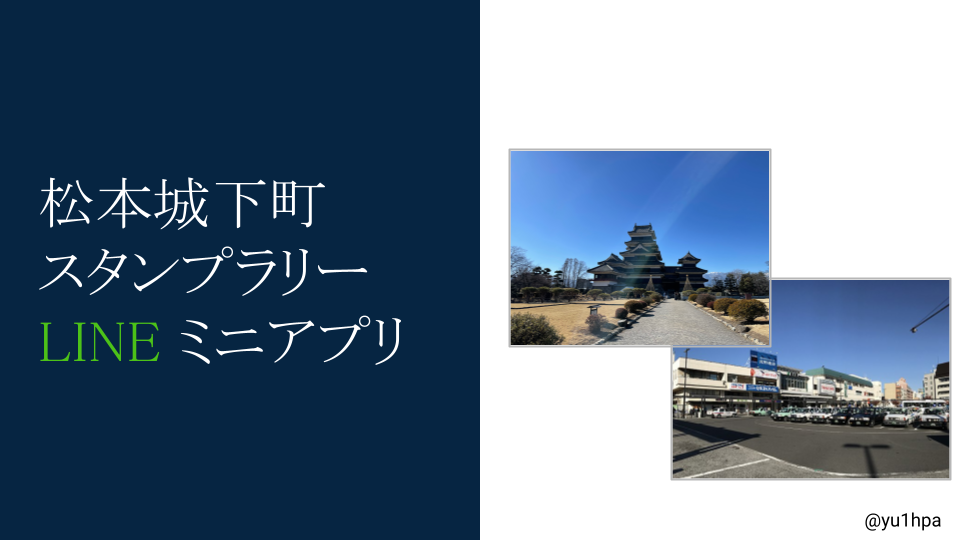

# 松本城下町 スタンプラリー LINE ミニアプリ



## 技術スタック

コアサーバー

- Express.js(TypeScript)

QR コードリーダー

- LIFF, React(TypeScript)
- Express.js(TypeScript)

みんなの思い出(memories gallery)

- Next.js(TypeScript)
- Express.js(TypeScript)

## 使い方

MinIO, PostgreSQL を起動

```
docker compose up --build
```

core-server を起動

```
cd core-server && pnpm start
```

qrcode-reader を起動

```
cd qrcode-reader/server && pnpm start
cd qrcode-reader/ui && yarn dev
```

memories-gallery を起動

```
cd memories-gallery/server && pnpm start
cd memories-gallery/ui && pnpm dev
```

また、各ディレクトリに配置されている`.env.sample`を`.env`にコピーして必要な情報を書く必要がある。

## 作者

@yu1hpa

## ライセンス

The source code is under MIT LICENSE  
BUT, Idea is <a rel="license" href="http://creativecommons.org/licenses/by-nc/4.0/"></a><br />
